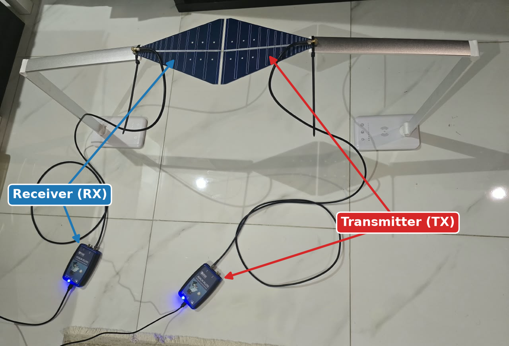
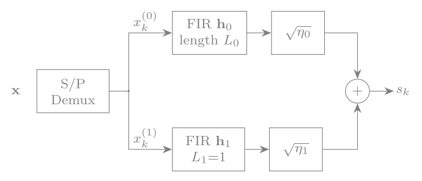
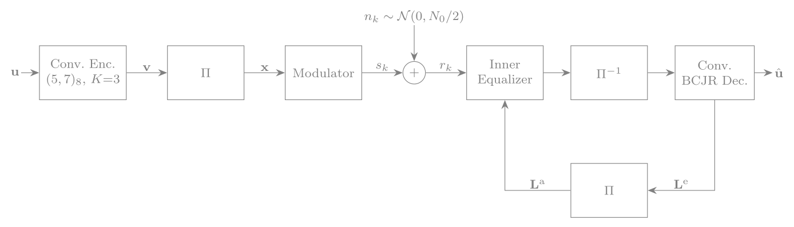
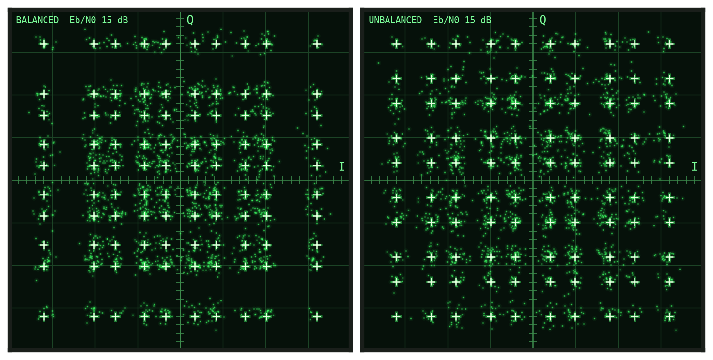
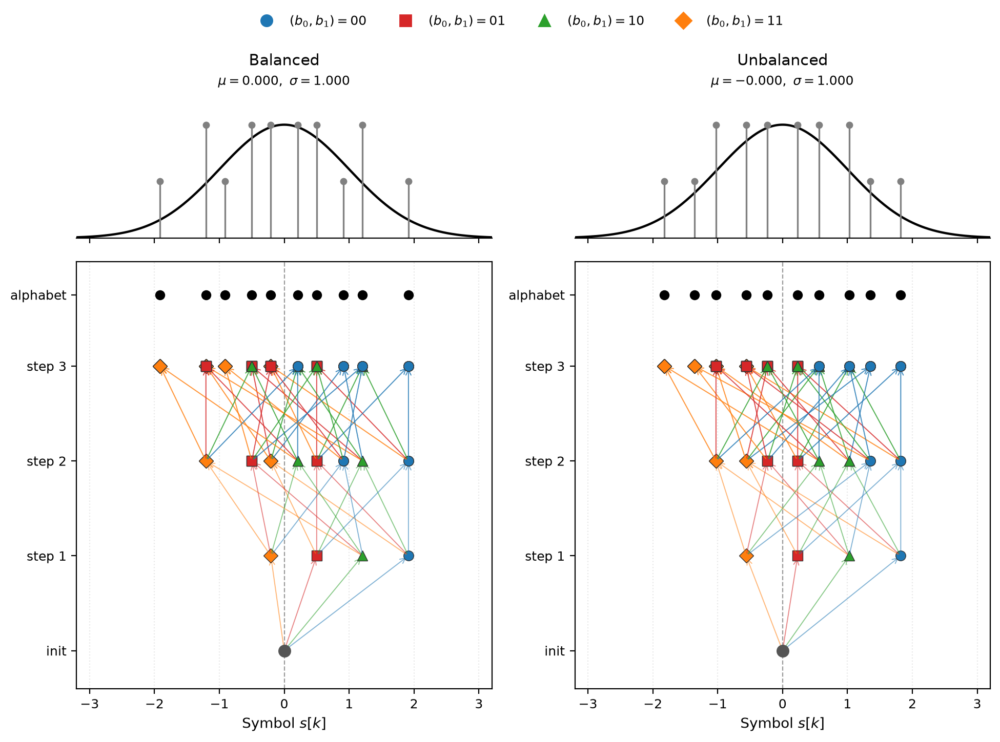
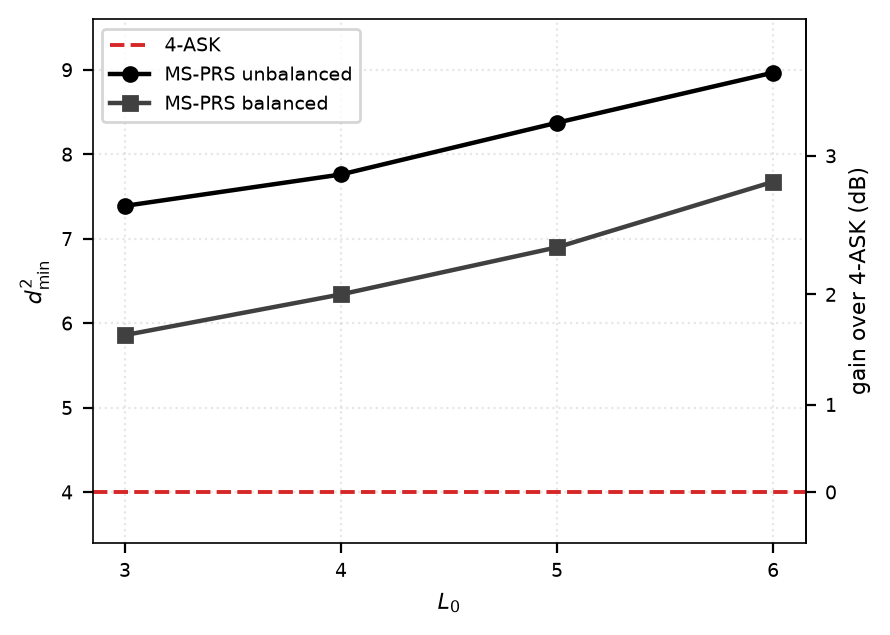
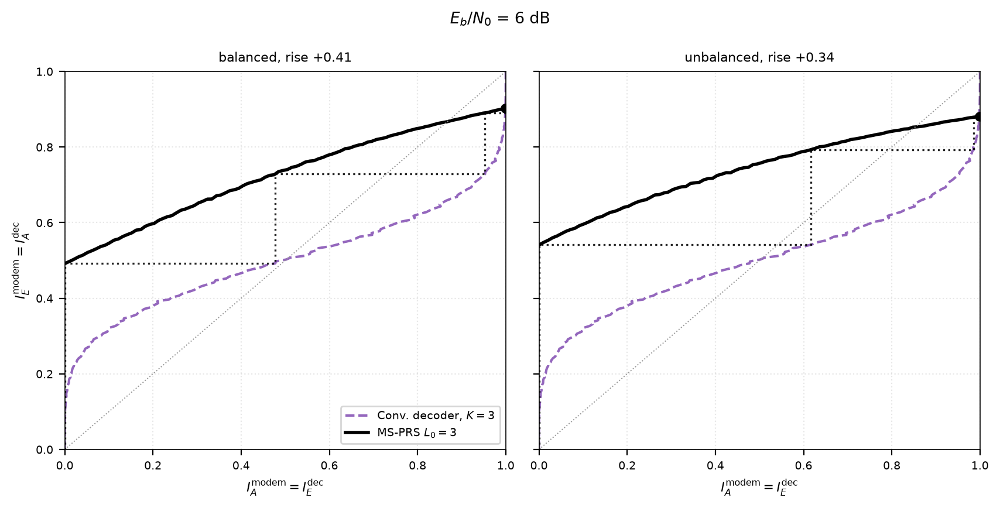
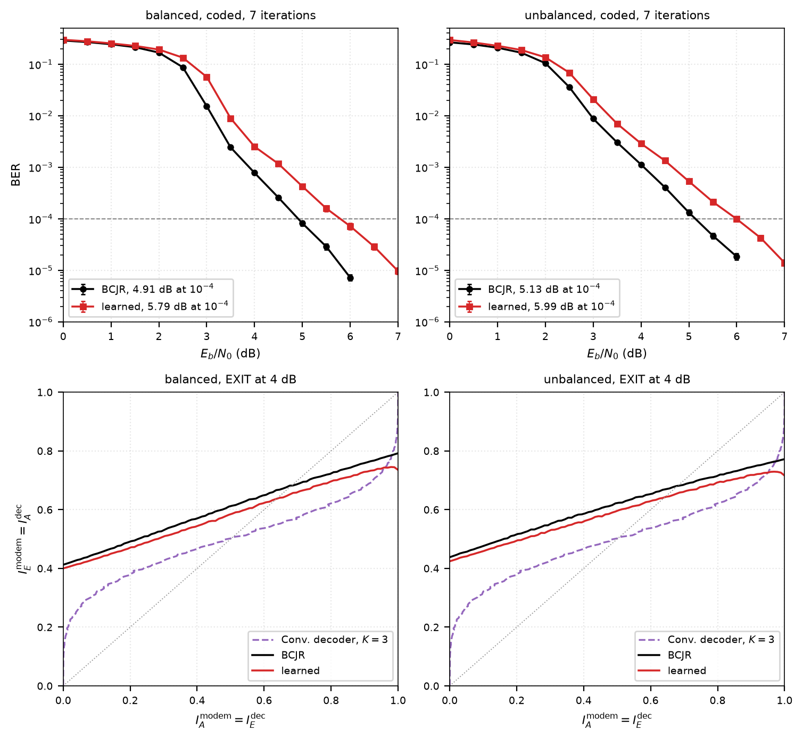

# Turbo-Equalized MS-PRS

**Multi-Stream Partial Response Signaling (MS-PRS)** is a modulation scheme at the Nyquist rate that adds controlled intersymbol interference through short FIR filters across two bipolar sub-streams, instead of compressing the symbol period the way faster-than-Nyquist signaling does. MS-PRS at Rate 2 carries two bits per channel use. This project uses [AFF3CT](https://github.com/aff3ct/aff3ct) for efficient BER simulations and tests the scheme over the air between two ADALM-Pluto software-defined radios.

The experimental setup: the transmitter (right) and the receiver (left) each
feed a log-periodic antenna, and the two antennas face each other. The link runs
at 448 MHz, and each radio has its own crystal.

<p align="center">
  
</p>

Inside the modulator, the interleaved bits split into two bipolar sub-streams. One runs through
an `L0`-tap FIR filter `h0`, which is where the controlled ISI comes from; the other passes a
single tap. The two are scaled and summed into one Nyquist-rate symbol, carrying two bits between
them. The gains set the energy split, `eta_0 + eta_1 = Es`: the balanced family divides it evenly,
the unbalanced family tilts it toward the single-tap stream.

<p align="center">
  
</p>

The chain the simulator runs: encode, interleave, modulate, then a receiver that passes extrinsic information between the equalizer and the decoder. The receiver is a turbo loop: a BCJR equalizer on the `2^(L0-1)`-state trellis trades log-likelihood ratios with a rate-1/2 convolutional or LDPC decoder.

<p align="center">
  
</p>

Both BCJRs, the equalizer's and the convolutional decoder's, run one of three
algorithms, chosen with `--bcjr`. MAP works on probabilities and is exact; it
is the default. log-MAP works on their logarithms and reads the Jacobian
correction from a table. max-log-MAP drops the correction. For `L0 = 3` with 7
iterations, balanced / unbalanced, on one thread of a Ryzen 5 3600X:

| `--bcjr` | Eb/N0 at BER 1e-3 | Eb/N0 at BER 1e-4 | Time per frame | Speed vs MAP |
|---|---|---|---|---|
| `map` (default) | 3.89 / 4.06 dB | 4.91 / 5.13 dB | 11.3 / 11.8 ms | 1.00 / 1.00× |
| `log-map` | 3.88 / 4.03 dB | 4.89 / 5.21 dB | 16.8 / 17.8 ms | 0.68 / 0.67× |
| `max-log-map` | 4.38 / 4.06 dB | 4.91 / 5.21 dB | 5.8 / 5.9 ms | 1.95 / 2.00× |

Differences under 0.1 dB are Monte Carlo scatter. max-log-MAP loses half a
decibel where the balanced loop starts to converge, and nothing once it has.
log-MAP is slower than MAP here: on a CPU a multiply-add costs no more than an
add, while every log-domain addition still needs a comparison and a table
lookup. Its advantage belongs to fixed-point hardware. A frame is 4998
information bits and 8 passes of each BCJR; `msprs --mode timing --L0 3 --ebn0 4`
reproduces the times.

Received symbols on the I/Q plane, measured over the air between the two
radios at 15 dB. White crosses mark the ideal points; the scatter around them is
what the equalizer works with.

<p align="center">
  
</p>

Above, the symbol alphabet and how often each level occurs, against a Gaussian
of the same mean and variance. Below, the values reachable in three steps from
the all-zero state, coloured by the input pair that produced them.

<p align="center">
  
</p>

## Minimum Squared Euclidean Distance

The BER performance at high-SNR slope is set by `d2_min`. This is where the error-rate advantage
lives. Every design clears 4-ASK by 1.7 to 3.5 dB.

<p align="center">
  
</p>

## EXIT Chart

The equalizer's characteristic against the decoder's, mirrored. The gap
between them is the tunnel the turbo loop climbs.

<p align="center">
  
</p>

## Learned Equaliser

A small network in place of the BCJR, trained on the transmitted bits and run
inside the same turbo loop. On the Gaussian channel it trails the BCJR by about
0.9 dB at a BER of 1e-4. It is meant for the radio link, where the received
signal departs from the Gaussian model the BCJR assumes.

<p align="center">
  
</p>

## Run It

Build the simulator, then run any mode:

```
cmake -S . -B build -DCMAKE_PREFIX_PATH="$PWD/.aff3ct/install"
cmake --build build -j

build/bin/msprs --mode coded-msprs --L0 3 --family balanced --iters 7
```

Full build steps and every mode are in [docs/build.md](docs/build.md);
conventions and the record format in [docs/reference.md](docs/reference.md).

The tap tables in [filters/](filters) are the single source of truth for both
filter families and every `L0`.

The notebooks read what the simulator writes and draw the figures above. They
compute nothing themselves:

```
python -m venv .venv && . .venv/bin/activate
pip install numpy matplotlib jupyter
jupyter lab notebooks/
```

## License

Apache 2.0, see [LICENSE](LICENSE). AFF3CT is a separate project under the
MIT licence.
